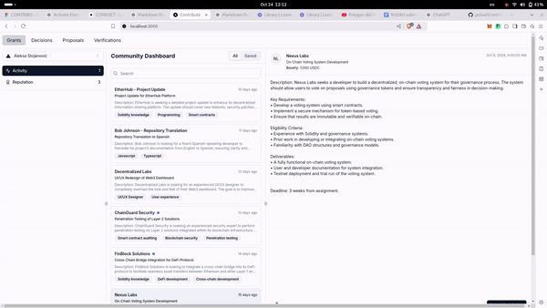

# CONTRIBO – Proof of Contribution

## Description
CONTRIBO is a decentralized marketplace for bounties and grants within the Web3 ecosystem, designed to connect builders, funders, and the community. It enables users to create and complete tasks, build their reputation, and get rewarded transparently through smart contracts. This project aims to optimize ROI for grants, facilitate onboarding for newcomers, and ensure accountability through reputation-driven decision-making.

## Features
- **Create a Profile**: Start by creating your profile, where you can set your display name, list your skills, and link your wallet to receive payments.
- **Bounty and Grant Creation**: Users can create grants composed of multiple bounties with clear objectives, deliverables, and milestones.
- **Reputation-Based Task Allocation**: Contributors can stake their reputation and earn points based on task completion and community reviews.
- **Milestone-Based Payments**: Funds are held in smart contracts and released only upon successful completion and approval of deliverables.
- **Community Validation**: Incorporates UMA KPIs or other voting mechanisms to validate task success and ensure transparency.
- **Onboarding Pathway**: A clear path for new contributors to join, grow their reputation, and take on more complex projects.
- **Submit Work**: Once you complete a task, upload your deliverable (e.g., GitHub PR, design files, etc.) and click “Submit for Review.”
- **Receive Payment**: After a successful review, the smart contract automatically deploys the reward to your linked wallet.

## Installation
1. Clone the repository:
    ```bash
    git clone git@github.com:polux0/contribo.git
    ```
2. Install dependencies:
    ```bash
    cd ui &npm install
    ```
3. Set up environment variables:
    - Create a `.env` file in the root directory based on `.env.example` and add the necessary variables.

4. Start the project:
    ```bash
    npm run dev
    ```

## Usage
1. **Create a Profile**: Start by creating your profile, where you can set your display name, list your skills, and link your wallet for receiving payments.
2. **Search for Tasks**: Use the search bar to find tasks or contributors. Example searches include “Solidity Developer” or “UI Designer.”
3. **Apply for a Task**: Click on a listed task, review the details, and click “Apply” to express interest and provide a brief proposal or portfolio link.
4. **Submit Work**: Once you complete a task, upload your deliverable (e.g., GitHub PR, design files, etc.) and click “Submit for Review.”
5. **Receive Payment**: After a successful review, the smart contract automatically deploys the reward to your linked wallet.

## Demo



## Video

[Watch the Full Demo on Loom](https://www.loom.com/share/b7282966c6c14ad9957a9f6181789d66?sid=39338261-1be2-4049-8aca-c0d0ffabf59f)

## Presentation

[Download PDF Presentation](Contribo-strategic-proposal.pdf)